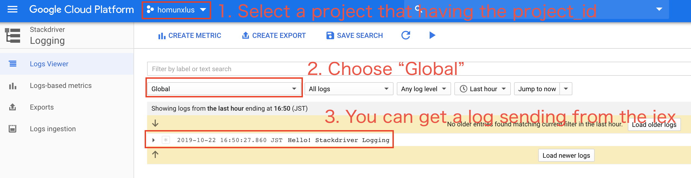

# Google Cloud Stackdriver Logging Samples

This project includes samples for running [Google Cloud Stackdriver Logging](https://cloud.google.com/logging/).

## Installing Dependencies

Install the dependencies, namely `stackdriver_logging_samples`, using Mix:

```sh
mix deps.get
```

## Authentication

Authentication is typically done through [Application Default Credentials][adc]
which means you do not have to change the code to authenticate as long as
your environment has credentials. Start by creating a
[Service Account key file][service_account_key_file]. This file can be used to
authenticate to Google Cloud Platform services from any environment. To use
the file, set the `GOOGLE_APPLICATION_CREDENTIALS` environment variable to
the path to the key file, for example:

    export GOOGLE_APPLICATION_CREDENTIALS=/path/to/service_account.json

## Running the Samples

Use Interactive Elixir and Mix to compile and run the samples

```sh
iex -S mix
```

Now you can run the samples! For example, to write a log,
type the following into the Interactive Elixir shell:

```elixir
iex(1)> project_id = "project_id_which_you_want_to_send"
"project_id_which_you_want_to_send"
iex(2)> log_id = "log_id_which_you_named"
"log_id_which_you_named"
iex(3)> GoogleApi.StackdriverLogging.Samples.write(project_id, log_id, "Hello! Stackdriver Logging")
{:ok, %GoogleApi.Logging.V2.Model.WriteLogEntriesResponse{}}
```

Then you check [log viewer](log_viewer), you get logs you've sent.




[adc]: https://cloud.google.com/docs/authentication#getting_credentials_for_server-centric_flow
[service_account_key_file]: https://developers.google.com/identity/protocols/OAuth2ServiceAccount#creatinganaccount
[log_viewer]: https://console.cloud.google.com/logs/viewer
